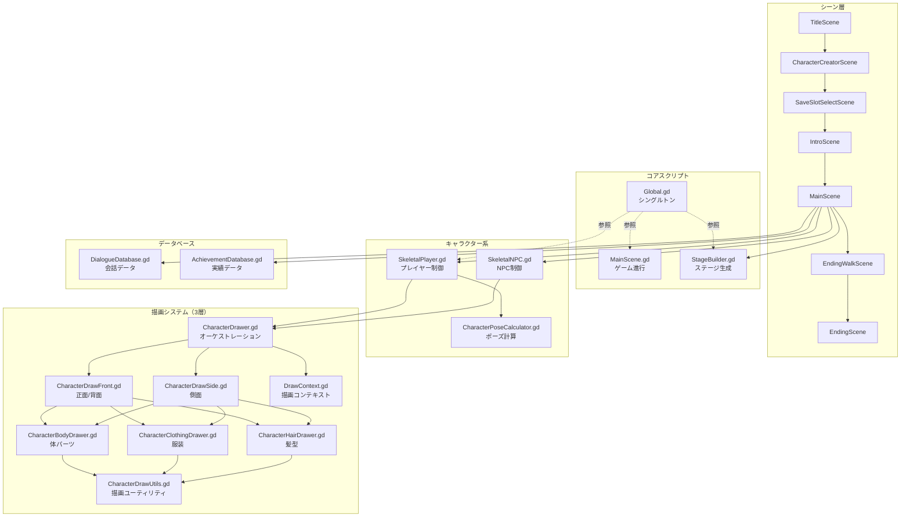

# CLAUDE.md — tall_life_simulator

Claude Code 向けプロジェクト定義ファイル。会話開始時に必ず参照する。

---

## 一般的な要望

- 複雑な処理は subagent を使ってください

## プロジェクト概要

**Tall Life Simulator** — 背の高い人の日常生活を追体験できる Godot 4.x 製ゲーム。

| 項目 | 内容 |
|---|---|
| エンジン | Godot 4.6 |
| 言語 | GDScript |
| リリース先 | GitHub Pages (`docs/`) |
| ブランチ戦略 | `develop` が主幹、機能は `feat/*` で分岐 |

---

## シーン遷移フロー

```
TitleScene
  └─> CharacterCreatorScene（身長・頭身・脚比・外見選択）
        └─> SaveSlotSelectScene（スロット選択）
              └─> IntroScene（オープニング）
                    └─> MainScene（メインゲーム）
                          ├─ [続ける] → MainScene 継続
                          └─ [エンディングへ] → EndingWalkScene
                                                    └─> EndingScene（身長比較）
```

---

## アーキテクチャ図



---

## 全スクリプト一覧

| スクリプト | パス | 行数 | 責務 |
|---|---|---|---|
| `MainScene.gd` | `scripts/MainScene.gd` | ~4559 | ゲーム進行、UI、ダイアログ、学期・ステージ遷移 |
| `StageBuilder.gd` | `scripts/StageBuilder.gd` | ~4428 | ステージ構築（障害物・背景・オブジェクト定義） |
| `Global.gd` | `scripts/Global.gd` | ~978 | シングルトン、キャラクター状態、成長パラメータ、グローバルフラグ |
| `CharacterClothingDrawer.gd` | `scripts/CharacterClothingDrawer.gd` | ~855 | 服装パーツ描画（スカート・ズボン・上着等） |
| `CharacterHairDrawer.gd` | `scripts/CharacterHairDrawer.gd` | ~678 | 髪型・髪色描画 |
| `DialogueDatabase.gd` | `scripts/DialogueDatabase.gd` | ~654 | 会話データベース（はるか・先生・NPC等） |
| `EndingWalkScene.gd` | `scripts/EndingWalkScene.gd` | ~647 | エンディング歩行アニメーション（成長追体験） |
| `CharacterBodyDrawer.gd` | `scripts/CharacterBodyDrawer.gd` | ~645 | 体部分描画（頭・胴体・腕・脚） |
| `SkeletalNPC.gd` | `scripts/SkeletalNPC.gd` | ~575 | NPC挙動制御（反応・会話トリガー） |
| `SkeletalPlayer.gd` | `scripts/SkeletalPlayer.gd` | ~441 | プレイヤー制御（入力・移動・ポーズ） |
| `CharacterCreatorScene.gd` | `scripts/CharacterCreatorScene.gd` | ~430 | キャラクター作成シーン |
| `CodexSmokeRunner.gd` | `scripts/CodexSmokeRunner.gd` | ~353 | 実績・コーデックス表示 |
| `CharacterPoseCalculator.gd` | `scripts/CharacterPoseCalculator.gd` | ~292 | ポーズ計算エンジン（骨格位置・屈み二分探索） |
| `CharacterDrawUtils.gd` | `scripts/CharacterDrawUtils.gd` | ~252 | 純粋描画ユーティリティ（楕円・台形・五角形等） |
| `CharacterDrawFront.gd` | `scripts/CharacterDrawFront.gd` | ~209 | 正面・背面描画オーケストレーション |
| `MapTravelPanel.gd` | `scripts/MapTravelPanel.gd` | ~186 | 高速移動パネル |
| `CharacterDrawSide.gd` | `scripts/CharacterDrawSide.gd` | ~181 | 側面描画オーケストレーション |
| `EndingScene.gd` | `scripts/EndingScene.gd` | ~180 | エンディング身長比較画面 |
| `SaveSlotSelectScene.gd` | `scripts/SaveSlotSelectScene.gd` | ~166 | セーブスロット選択画面 |
| `AchievementDatabase.gd` | `scripts/AchievementDatabase.gd` | ~166 | 実績定義データベース |
| `GrowthGraph.gd` | `scripts/GrowthGraph.gd` | ~118 | 成長グラフ表示 |
| `CharacterDrawer.gd` | `scripts/CharacterDrawer.gd` | ~113 | 描画オーケストレーション（facing・色・DrawContext構築） |
| `IntroScene.gd` | `scripts/IntroScene.gd` | ~85 | イントロシーン |
| `TitleScene.gd` | `scripts/TitleScene.gd` | ~77 | タイトルシーン |
| `DrawContext.gd` | `scripts/DrawContext.gd` | ~57 | 描画コンテキスト（色・寸法・服装情報保持） |
| `HeightChart.gd` | `scripts/HeightChart.gd` | ~52 | 身長チャート表示 |
| `MiniPlayerProxy.gd` | `scripts/MiniPlayerProxy.gd` | ~14 | ミニプレイヤープロキシ |

> パスはすべて `godot-project/scripts/` 以下。

---

## キャラクター描画システム（3層構造）

> 詳細仕様: [specs/character_drawing_system.md](specs/character_drawing_system.md)

### 層の責務

```
Layer 1: オーケストレーション
  CharacterDrawer.gd
    └─ DrawContext 構築（色・寸法・服装キャッシュ）
    └─ facing に応じて Layer 2 に委譲

Layer 2: ビュー別合成
  CharacterDrawFront.gd  ← facing == "front" / "back"
  CharacterDrawSide.gd   ← facing == "side"
    └─ 描画順序管理（体→服→髪）
    └─ stress ポーズ補正

Layer 3: パーツ描画
  CharacterBodyDrawer.gd     ← 頭・胴体・腕・脚
  CharacterClothingDrawer.gd ← スカート・ズボン・ブラウス
  CharacterHairDrawer.gd     ← ショート・ポニテール等
  CharacterDrawUtils.gd      ← 純粋描画関数
```

### part_shapes（パーツ形状定義）

```gdscript
var part_shapes = {
    "head":               "ellipse",
    "torso_lower":        "trapezoid",
    "torso_upper":        "trapezoid",
    "torso_front_lower":  "pentagon",   # 股の表現（下に頂点が突き出た5角形）
    "torso_front_upper":  "rect",
    "limb":               "stick",
    "neck":               "limb",
}
```

### 描画システム拡張手順

1. `CharacterDrawUtils.gd` に `draw_***()` 関数を追加
2. 対応する Drawer（Body/Clothing/Hair）に描画ロジックを追加

---

## 主要なデータ構造

### 身体パラメータ `m`（`Global.get_body_measurements()` の出力）

```gdscript
m = {
    "height":   180.0,   # 身長（cm）
    "head":      25.0,   # 頭の大きさ（cm）
    "arm":       45.0,   # 胸→股距離（cm）
    "leg":       85.0,   # 股下高さ（cm）
    "shoulder":  35.0,   # 肩幅（cm）
    "ratio":      7.2,   # 頭身
    "legRatio":  48.0,   # 脚比率（%）
}
```

### 外見辞書 `appearance`

```gdscript
appearance = {
    "hair_style":    "short" | "ponytail" | "side_tail",
    "hair_color":    "#4a3c31",
    "tops_type":     "t_shirt" | "school_uniform" | "blouse_bow",
    "tops_color":    "#ab82a8",
    "bottoms_type":  "pants" | "skirt_short" | "skirt_long",
    "bottoms_color": "#3a5f8a",
    "shoes_type":    "loafer" | "sneakers",
    "shoes_color":   "#4b4b52",
    "hat_type":      "none" | "school_hat",
    "bag_type":      "none" | "randoseru",
}
```

### ポーズデータ `d`（`CharacterPoseCalculator` の出力、60+値）

```gdscript
d = {
    "hx", "hy":          # 頭部中心座標
    "cx", "cy":          # 股座標（基準点）
    "head_h":            # 頭部高さ（px）
    "shoulder_l_x/y",    # 左右肩座標
    "chest_y", "navel_y":# 胸・へそ高さ
    "leg_l_angle",       # 脚振り角（度）
    "knee_l/r":          # 膝屈み角（rad）
    "arm_l/r_angle":     # 腕振り角
    "waist_angle":       # 腰捻り（rad）
    "is_crouching":      # 屈み中フラグ
    "crouch_t":          # 屈みパラメータ [0, 2]
    ...
}
```

### 成長記録エントリ `growth_history`（`Global` が保持）

```gdscript
{
    "term":      6,        # 学期番号
    "age":       6,        # 年齢
    "height":    115.2,    # 身長（cm）
    "avg_height":113.0,    # 学年平均身長
    "diff_avg":  2.2,      # 平均との差
    "diff_prev": 1.5,      # 前回からの伸び
    "source":    "start" | "measurement"
}
```

---

## ディレクトリ構成

```
tall_life_simulator/
├── godot-project/
│   ├── scripts/            # GDScript（27ファイル）
│   ├── scenes/             # .tscn シーンファイル（7シーン）
│   └── project.godot
├── docs/                   # GitHub Pages（ビルド成果物、直接編集不可）
├── assets/                 # 素材ファイル
└── specs/                  # 仕様書
    ├── spec.md
    ├── character_drawing_system.md
    ├── character_pose_spec.md
    ├── clothing_and_hair_logic.md
    ├── clothing_crouch_logic.md
    ├── hair_drawing_system.md
    ├── plan_by_agent.md    # AI が自由に編集可能なメモ帳
    ├── spec.local.md       # ユーザのメモ（編集不可）
    └── game_story/
        ├── game_story_spec.md
        ├── dialogue_trigger_spec.md
        └── stage_design.md
```

---

## 開発ルール

### 基本
- **すべて日本語で応答する**
- 思考プロセスも日本語で表示する
- `docs/` は GitHub Pages 用。直接編集しない
- `*.local.md` はローカルメモ。Git にコミットしない

### コミット規約
```
feat: メッセージ（日本語）

Co-Authored-By: Claude Sonnet 4.6 <noreply@anthropic.com>
```

- prefix: `feat` / `fix` / `refactor` / `docs` / `chore`
- コミット前に必ず動作確認を行う

### ファイル編集の優先度
1. **既存ファイルを編集** — 新規ファイルは必要最小限に
2. **変更は最小スコープ** — 要求外の改善は行わない
3. **セキュリティ** — GDScript でも外部入力のバリデーションに注意

---

## AI エージェントのメモ管理

| ファイル | 用途 | 編集権限 |
|---|---|---|
| `specs/plan_by_agent.md` | AI が自由に使うメモ帳 | AI が編集可 |
| `specs/spec.local.md` | ユーザのメモ | **編集不可** |
| `CLAUDE.md` | このファイル | 必要時のみ更新 |

---

## よく使うコマンド

```bash
# Godot プロジェクトをコマンドラインで実行
godot --path godot-project/

# Git: 機能ブランチ作成
git checkout develop && git pull && git checkout -b feat/XXX
```

---

## 会話分割の指針（効率化）

各会話は **1タスク1会話** を原則とする。以下を目安に分割する：

- シーン追加・変更
- バグ修正
- スクリプトのリファクタリング
- 仕様確認・設計相談

会話開始時に「今回のスコープ」を一言で宣言してから作業を始める。
